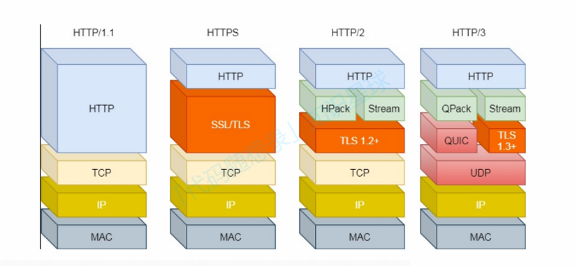
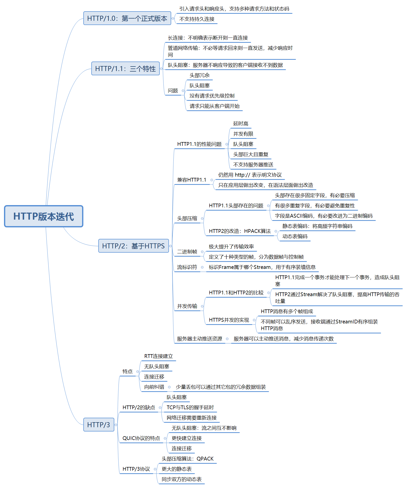
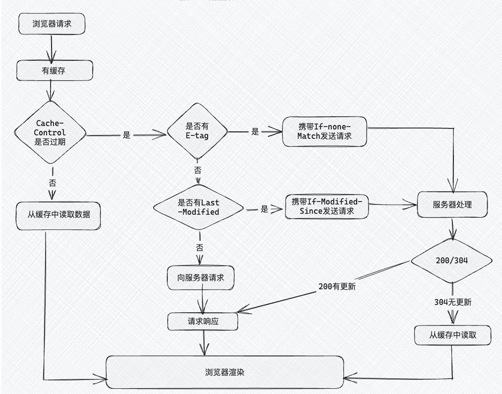

## 在浏览器输入URL之后会发生什么

1. **输入URL并解析**  
   浏览器解析出协议、主机、端口、路径等，构造一个HTTP请求

2. **DNS域名解析**   
   将域名（URL）解析成一个IP地址

3. **建立TCP三次握手**  
   客户端与服务器端进行HTTP请求和响应

4. **浏览器发送HTTP请求到web服务器**

5. **服务器处理HTTP请求并返回HTTP报文**  
   返回响应报文

6. **浏览器渲染页面**

7. **断开连接之TCP四次挥手**  
   客户端与服务器端断开连接  

## DNS

### 1. DNS是什么
将域名转换为IP地址的分布式系统

### 2. DNS若集中设计产生的问题
1. 若单点故障，则网络瘫痪
2. 全世界集中DNS造成延时
3. 维护成本巨大

### 3. 域名的层级关系
域名用`.`分割，越右边的层级越高

### 4. DNS解析过程
1. 询问浏览器缓存、本地缓存
2. 向本地DNS询问，如果没有，**本地DNS解析器**询问**根DNS**
3. 根DNS告诉本地DNS域名在哪个顶级服务器，顶级服务器告诉本地找哪个权威服务器
4. 权威服务器找到IP地址，返回本地解析器
5. 本地DNS解析器将IP返回浏览器，并缓存域名解析结果
6. 浏览器建立连接，获取网页内容

### 5. 递归查询和迭代查询
* 递归查询适用于普通用户和客户端，客户端只发送一个请求
* 迭代查询适用于DNS服务器之间的通信，一个一个向更高级服务器查询

## HTTP特性与简述

### 简述
* web上的通信都是建立在HTTP协议之上
* www构建技术
  * HTML(*HyperText Markup Language*)
  * HTTP(*HyprtText Transfer Protocol*)
  * URL(*Uniform Resource Location*)

### 版本迭代
1. HTTP/1.0
2. HTTP/1.1
3. HTTP/2.0

### 特性
1. 简单，易于理解
2. 灵活，易于扩展
3. 无状态，明文传输，不安全
   * 无状态：服务器不保存HTTP的状态，解决方式*cookie*
   * 明文传输：容易被窃取
   * 不安全：可以用HTTPS的方式解决：引入SSL/TLS层

## HTTP版本迭代

## HTTP缓存
* 对于已经请求过的资源，客户端或服务器会保存在本地。HTTP缓存分为强制缓存和协商缓存
* 协商缓存需要配合强制缓存使用，只有在未能命中强制缓存时才会发起协商缓存

### 强制缓存
浏览器判断目标资源是否有效命中强缓存，如果命中则直接读取，毋须与服务器做任何通讯
* 强缓存分为`Expires`和`Cache-Control`；`Cache-Control`在资源响应头上写需要缓存多久就行了
* 浏览器第一次访问资源时，在服务器在返回头加上`Cache-Control`，设置过期时间大小
* 再次访问资源时，判断资源是否过期
* 服务器再次请求后，更新`Cache-Control`

### 协商缓存
服务器告知客户端是否可以使用缓存

#### Last-Modified协商缓存
每次请求资源时，服务器判断这段时间资源是否更改，以此判断是否返回新资源。因为可以在短时间修改文件而不返回新的文件，故本方法不常用。

#### ETag协商缓存
优先级更高，将比较时间戳的形式改为比较**文件指纹**（文件的哈希）
* 第一次请求资源时，同时返回文件指纹
* 第二次请求时，客户端提取文件指纹，上传到服务端
* 服务端比较指纹，若没有改变则表示使用缓存，改变了则返回改变后的文件

缺点：
* 需要计算指纹，计算力开销大
* 强验证消耗计算力，弱验证降低指纹有效性

## HTTPS

### HTTPS协议
* HTTPS：*Hyper Text Transfer Protocol Secure* 超文本安全传输协议
* SSL：安全套接字
* TSL：安全传输层协议
* HTTPS = HTTP+SSL/TSL

### HTTPS的特点
#### 1. 特点
* **信息加密**：对称+非对称的混合加密方式
* **校验机制**：摘要算法生成**指纹**校验码，解决数据被篡改的风险
* **身份证书**：将服务端的公钥放入数字证书中，解决服务端被冒充的风险

#### 2. 优点
* 传输过程中密钥加密，安全性更高
* 可认证用户和服务器，确保数据的正确发送

#### 3. 缺点
* **握手阶段延时较高**：会话前还要SSL握手
* **部署成本高**：加密计算占用CPU资源

### HTTPS与HTTP的区别
* HTTP以明文传输，HTTPS在TCP与HTTP网络层之间加入SSL/TLS安全协议，使得报文可以加密传输
* HTTPS在TCP三次握手之后还要进行SSL/TLS握手，才可以进入报文加密传输
* HTTP的端口号是80，HTTPS是443
* HTTPS需要申请数字证书，确保服务器身份可信

### 信息加密
使用混合加密的方式，对传输的数据加密，解决窃听风险

#### 1. 对称加密
加密和解密都使用相同的密钥，算法速度较快，但一旦泄露，可以很容易被解密数据

#### 2. 非对称加密
公钥和私钥互不相同，一个用于加密，一个用于解密。非对称加密还用于*数字签名*

#### 3. 混合加密
通信建立前用非对称加密，通信建立后使用对称加密。原因考虑解密速度

### 校验机制
用摘要算法生成校验码，检验数据的完整性，解决了被篡改的风险  
摘要算法只能保证内容不被修改，用**非对称加密算法**能保证发送者身份

### 身份证书
* 将服务器公钥放入CA数字证书中，解决服务器被冒充的风险  
* 数字证书负责解决身份验证的环节
* 证书信任链是数字证书验证过程的一部分，确保证书由可信机构签发

### HTTPS是如何建立的

## TCP与UDP的头部格式

### UDP

* 端口：UDP应发送给哪个进程
* 包长度：头部与数据长度之和
* 校验和：校验是否出现差错

### TCP

* 序列号：解决网络包乱序问题
* 确认应答号：解决丢包问题；序列号和确认应答号用于实现可靠数据传输
* 首部长度：TCP头部字节长度
* 窗口大小：告诉本端TCP缓冲区还有多少空间接收，用以控制流量
* **标志字段**
  * ACK：是否成功接收报文段确认
  * RST：重置混乱连接，或拒绝无效连接
  * SYN：请求建立连接
  * FIN：断开连接
* **TCP选项**：可变长度，最长40字节
  * 第一个字段*kind*说明选项类型
  * 第二个字段*length*说明选项总长度
  * 第三个字段*info*是选项具体信息
  
## TCP的三次握手

### 三次握手的过程

#### 第一次握手：SYN报文
客户端随机初始化序列号`client_isn`，放入TCP**序列号**，并将SYN设置为1，表示发起连接。之后客户端处于`SYN-SENT`状态

#### 第二次握手：SYN+ACK报文
服务端在收到SYN报文后，将自己的随机初始化序列号`server-isn`放入TCP**序列号**，并在**确认应答号**填入`client_isn+1`，将SYN与ACK置为1，并将SYN+ACK发送给客户端，进入`SYN-RCVD`状态，表示服务器接收客户端请求，希望建立连接

#### 第三次握手：ACK报文
客户端将ACK标志设置为1，在**确认应答号**填入`server-isn+1`，将报文发送给服务端。**这次可以携带数据**，之后客户端处于`ESTABLISHED`状态，表示客户端准备与服务器进行数据传输

### 为什么需要三次握手
> 三次握手才能保证双方具有接收和发送的能力

#### 1. 阻止重复历史连接的初始化（主因）
* 如果客户端连发两个SYN，第二个SYN到达后客户端会判定这是一个**历史连接**，发送RST给服务端，释放连接
* 如果只有两次握手，客户端在收到一个SYN后就会`ESTABLISHED`，向客户端发送数据，造成资源浪费

#### 2. 同步双方初始序列号
TCP协议通信双方都要维护一个**序列号**，序列号是可靠传输的关键
1. 第一个携带客户端初始序列号报文
2. 第二个携带服务器初始序列号报文
3. 第三个携带服务器ACK应答报文
两次握手只能保证客户端序列号被服务器端接收，四次握手浪费了一次

#### 3. 避免资源浪费
如果只有两次握手，服务器每收到一个SYN就会建立一个连接，造成资源浪费

### 什么是半连接队列
* 服务器把**第一次收到的SYN请求连接**放入队列中，称之为半连接队列
* 已经完成三次握手的队列称之为**全连接队列**

### 什么是SYN攻击
攻击者伪造大量SYN，不完成后续握手过程，消耗服务器半连接队列与系统资源，导致服务器端无法与客户端连接

## TCP四次挥手

### 四次挥手的过程
1. 第一次挥手：客户端打算关闭连接时，发送FIN置1的**FIN报文**。此时客户端不再发送数据，但还可以接收数据
2. 第二次挥手：服务端收到后，发送ACK应答报文，将客户端序列号+1作为ACK的**序列号**，表明接收到客户端的报文
3. 第三次挥手：服务端处理完数据后，向客户端发送FIN报文
4. 第四次挥手：客户端收到FIN报文后应答ACK报文
5. 服务器收到ACK后处于`CLOSE`状态
6. 客户端在`2MSL`后自动进入`CLOSE`状态

### 为什么挥手四次
相比于建立连接的三次握手，断开连接时**服务端FIN与ACK分开发送**。ACK应答客户端，服务端可能还有数据需要处理和发送。不再发送数据时再发送FIN表示同意关闭

### 为什么需要TIME_WAIT状态
1. 网络中可能有滞留数据，这个时间让两个方向上的数据包都被丢弃，保证再出现的数据包都是新连接产生的
2. 保证最后的ACK可以被接收端收到。如果服务器没有收到ACK，服务端会重发FIN。一来一回刚好`2MSL`

### 为什么TIME_WAIT的时间是2MSL
1. MSL是`Maximum Segment Lifetime`报文最大生成时间，是报文在网络上存在的最长时间。超过这个时间报文将被丢弃
2. 发送方的数据包被接收方处理又响应耗时刚好2MSL
3. 一个MSL确保发送方ACK到达服务端，一个MSL确保没有收到重传FIN报文
4. 收到FIN重传，2MSL重新计时
5. TIME_WAIT太大的话浪费内存资源和本地端口

## TCP的机制

## TCP的重传机制
接收端收到信息后会回复消息表示收到消息。如果传输过程中数据包丢失，用重传机制解决问题

### 超时重传
设定一个计时器，超过指定时间没有收到ACK，就会重发数据
* **RTT与RTO**：*RTT*是往返时延，指的是数据包往返时间；*RTO*是超时重传时间，略大于RTT，且动态变化：超时数据再次超时时，`RTO *= 2`

### 快速重传
快速重传机制不以时间驱动，而以数据驱动。收到三个相同的ACK时，会在定时器过期前重传丢失报文

### SACK 选择性确认
解决重传哪些报文的问题；在TCP头部加入`SACK`，将已收到的数据信息发送给发送方，发送方只重传丢失的数据

### D-SACK
告诉发送方有哪些数据重复发送了
1. 让**发送方**知道是发出去的包丢了还是ACK丢了
2. 可以知道是不是**发送方**的数据包被网络延时了
3. 知道网络中是不是把发送方的数据复制了

## TCP的滑动窗口

### 窗口
* 即使往返时间很大，也不会降低通信效率
* 窗口的实现实际上是OS的缓存空间，在确认ACK收到前，消息缓存在缓冲池中
* 累计确认：ACK返回代表之前每个消息都受到了

### 什么决定窗口大小
TCP头部有一个字段*window*，是接收端告诉发送端还有多少缓冲区可以接收数据。**窗口大小由接收方窗口大小决定**

接收窗口大小**约等于**发送窗口大小，因为信息传输时延。

### 发送方的滑动窗口

### 程序如何表示发送方的四个部分

